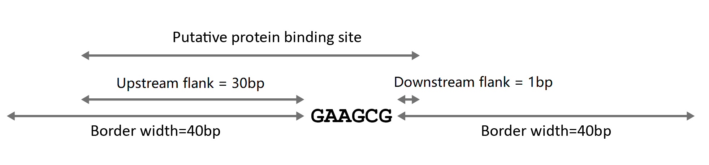
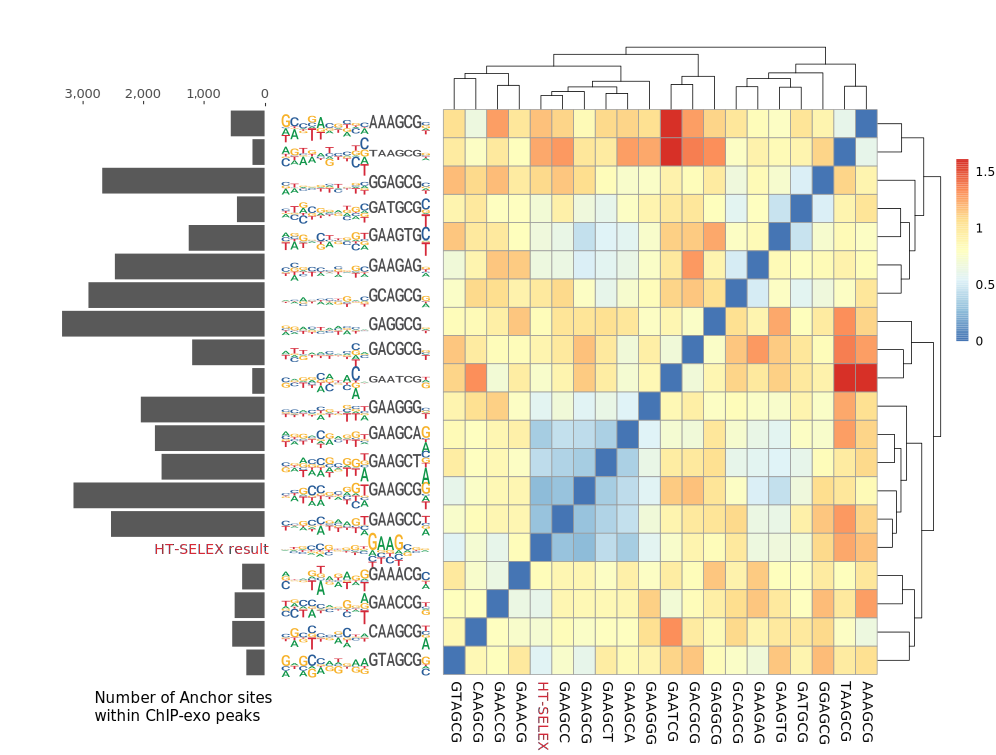

## Introduction
This Notebook includes the analysis workflow sequal to the previous "Iterative motif analysis of ZNF343", and is used to show that it is not only feasible, but also necessary to use such an iterative analysis method to extract the full specificity of long, tandem zinc finger proteins (ZFPs). Briefly, I generated the extended motif profiles based on different hexamer anchor sites, including the GAAGCG consensus and all its 18 single variants. Using correlation analysis and hiechical clustering, it is clear that only the GAAGCG consensus and GAAGCn anchors can serve as "good" anchors to produce longer specificity profiles highly similar to published HT-SELEX results, which also lends evidence to our proposed "Sequentional recognition", or "Anchor" model about the recognition of tandem zinc finger proteins. This analysis workflow could be generalzied to analyze other long ZFPs also.

```{r message=FALSE, warning=FALSE, include=FALSE}
library(dplyr)
library(magrittr)
library(ggplot2)
library(GenomicRanges)
library(BSgenome.Hsapiens.UCSC.hg19)
library(motifmatchr)
library(TFCookbook)
```

### Parameters used in this analysis workflow

```{r message=FALSE, warning=FALSE}
border_width <- 40
upstream_flank <- 30
downstream_flank <- 1

load("data/ZNF343_exo_peaks.RData") # Load processed ChIP-exo data of ZNF343, including exo reads and peaks positions in hg19 genome.
```

```{r message=FALSE, warning=FALSE, include=FALSE}
countExo <- function(chrom, start, end, direction, exoReads = ZNF343_exo_reads_by_chrome_strand) {
  if (direction == "+") {
    upstream_count <- exoReads[chrom, "+"][[1]] %>%
      filter(between(edge, start - border_width, end)) %>%
      tally(wt = n)

    downstream_count <- exoReads[chrom, "-"][[1]] %>%
      filter(between(edge, start, end + border_width)) %>%
      tally(wt = n)
  }
  else if (direction == "-") {
    upstream_count <- exoReads[chrom, "-"][[1]] %>%
      filter(between(edge, start, end + border_width)) %>%
      tally(wt = n)

    downstream_count <- exoReads[chrom, "+"][[1]] %>%
      filter(between(edge, start - border_width, end)) %>%
      tally(wt = n)
  }

  return((upstream_count + downstream_count)[[1]])
}

anchorModel <- function(anchor) {
  # Creating anchor motif with prefixed bases
  Anchor_pfm <- TFBSTools::PFMatrix(
    ID = "Anchor", name = anchor,
    profileMatrix = TFCookbook::anchorMatrix(anchor)
  )

  # Finding all anchor sites within ZNF343 ChIP-exo peaks
  Anchor_pos <- motifmatchr::matchMotifs(Anchor_pfm, ZNF343_peaks,
    genome = "hg19",
    out = "positions", p.cutoff = 1e-5,
  )[[1]] %>%
    as_tibble() %>%
    select(seqnames, start, end, strand) %>%
    mutate(exo_count = mapply(
      countExo,
      as.character(seqnames), start, end, strand
    ))

  # Extending the anchor position by fixed upstream and downstream distances
  Anchor_pos %<>%
    filter(exo_count > 0) %>%
    mutate(
      start = if_else(strand == "+",
        start - upstream_flank, start - downstream_flank
      ),
      end = if_else(strand == "+",
        end + downstream_flank, end + upstream_flank
      ),
      Energy = -log(exo_count)
    )

  # Extracting full sequences surrounding the anchor sites
  Anchor_pos$Sequence <- BSgenome::getSeq(Hsapiens,
    names = Anchor_pos$seqnames,
    start = Anchor_pos$start,
    end = Anchor_pos$end,
    strand = Anchor_pos$strand
  ) %>% as.character()

  return(TFCookbook::buildEnergyModel(Anchor_pos))
}


addAnchorMatrix <- function(energyMatrix, anchor, position, height){
  energyMatrix[,position:(position+nchar(anchor)-1)] <- -height*TFCookbook::anchorMatrix(anchor)
  
  return(energyMatrix)
}

```

## Building recognition models based on different anchor sites

```{r eval=FALSE, message=FALSE}
library(furrr)  # Do multi-core parallel computing
plan(multiprocess)

singleVariants <- tibble(Sequence = TFCookbook::kmer(6)) %>%
  mutate(Mismatch = TFCookbook::countMismatch(Sequence, "GAAGCG")) %>%  
  filter(Mismatch <= 1) %>% # Enumerating all single variants of GAAGCG anchor sites
  mutate(Model = furrr::future_map(Sequence, anchorModel)) %>% # Extracting extended specificity info based on each anchor site
  mutate(Anchor_count = purrr::map_int(Model, function(model) length(model$residuals))) # Counting the number of anchors found within ChIP-exo peaks
```


```{r echo=FALSE}
load("data/ZNF343_models.RData")

singleVariants %>%
  arrange(Mismatch)
```


Drawing the extended motif profile of ZNF343 based on consensus GAAGCG anchor site
```{r}
(singleVariants %>%
  filter(Sequence == "GAAGCG"))$Model[[1]] %>%
  TFCookbook::getEnergyMatrix() %>%
  addAnchorMatrix(anchor = "GAAGCG", position=31, height=0.2) %>%
  TFCookbook::plotEnergyLogo()
```


## Importing HT-SELEX result from JASPAR database
```{r}
ZNF343_SELEX.PFM <- TFBSTools::readJASPARMatrix("data/ZNF343.jaspar") %>% TFBSTools::reverseComplement() # Importing PFM from JASPAR database

ZNF343_SELEX.PFM@profileMatrix %>%
  TFCookbook::toEnergyMatrix() %>% # Converting PFM to energyMatrix based TFCookbook function toEnergyMatrix
  TFCookbook::plotEnergyLogo() +   # Plotting Energy logo of ZNF343 HT-SELEX result
  ggtitle("Energy matrix based on HT-SELEX result")  +
  scale_x_discrete(label=21:37)

ggsave("images/ZNF343_SELEX.svg", width=6, height=3, units="in")
```
```{r}
(ZNF343_SELEX.Coeffs <-
  (ZNF343_SELEX.PFM@profileMatrix %>%
  TFCookbook::toEnergyMatrix() %>%
  TFCookbook::toCoeffs())[c(1:30, 49:51)])
```

## Ploting extended motif for each anchor site based on the ChIP-exo reads in flanking regions

```{r fig.height=10, fig.width=10}
logo_list <- purrr::map2(
  singleVariants$Sequence,
  singleVariants$Model,
  function(sequence, model) {
    -(TFCookbook::getEnergyMatrix(model) %>%
      addAnchorMatrix(anchor = sequence, position = 31, height = 0.2))[,21:37]
  }
)

(logos <- ggplot() +
  ggseqlogo::geom_logo(logo_list, method="custom", seq_type = "dna")  + 
  ggseqlogo::theme_logo() +
  facet_wrap(~seq_group, ncol=4, scales='free_x') +
  ylim(-0.7, 0.7) +
  scale_x_continuous(breaks = seq(1,17,2), label = seq(1,17,2)))


ggsave("images/ZNF343_logos.eps", plot=logos, width=10, height=10, units="in")
```


## Comparing extended motifs of all single variants and published HT-SELEX result

### Building Heatmap and Hiechical clustering based on the correlation coefficients between pairs of extended motifs
```{r}
Heatmap_data <- sapply(singleVariants$Model, function(x) x$coefficients[c(62:91,110:112)]) %>%
  na.omit() %>%
  as.data.frame()

colnames(Heatmap_data) <- singleVariants$Sequence

Heatmap_data$'HT-SELEX' <- ZNF343_SELEX.Coeffs

Heatmap <- pheatmap::pheatmap(1-cor(Heatmap_data))

ggsave("images/Heatmap_ZNF343.svg", plot=Heatmap)
```


### Displaying the total number anchors sites found within the ChIP-exo peaks
```{r}
singleVariants[Heatmap$tree_row$order,] %>%
  ggplot(aes(x=Sequence, y=Anchor_count)) +
  geom_bar(stat="identity") +
  theme(axis.text.x = element_text(angle = -90, vjust = 0.28)) +
  xlab("Anchor sequence") +
  ylab("Number of anchor sites within ChIP-exo peaks")
```

## Summary of results
